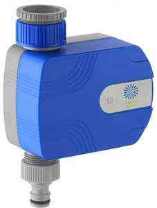

=================================================
MQTT Bluetooth Service for Aqua Systems Tap Timer
=================================================

Also known as `Yardeen Bluetooth Irrigation Sprinkler <https://www.amazon.com/Yardeen-Bluetooth-Irrigation-Sprinkler-Controller/dp/B071GWL5TP>`_
for sale on Ebay.

This package includes
- a service to interface to the Tap Timer over Bluetooth
- an MQTT service to send updates to a central broker and receive commands to update attributes
- Home Assistant custom components to display values

TODO:

- Only connect to device as needed
- Implement Notify option for attributes
- Allow changing attributes from Home Assistant
- Test on Raspberry Pi
- Support all attributes of the device
- MQTT auto discovery for Home Assistant

Bluetooth Service
-----------------

The driver allows connecting, disconnecting, reading and setting attributes on the device.

Supported attributes are

=================   =============   ====================================
Name                Supported       UUID
-----------------   -------------   ------------------------------------
On Status           Read            0000fcc2-0000-1000-8000-00805f9b34fb
Time                Read, Write     0000fcc4-0000-1000-8000-00805f9b34fb
Status              Read            0000fcd1-0000-1000-8000-00805f9b34fb
Cycle Duration      Read, Write     0000fcd2-0000-1000-8000-00805f9b34fb
Cycle Frequency     Read, Write     0000fcd3-0000-1000-8000-00805f9b34fb
Cycle 1 Start       Read, Write     0000fcd4-0000-1000-8000-00805f9b34fb
Cycle 2 Start       Read, Write     0000fcd5-0000-1000-8000-00805f9b34fb
Rain Delay Days     Read, Write     0000fcd5-0000-1000-8000-00805f9b34fb
Manual Time Left    Read, Write     0000fcd9-0000-1000-8000-00805f9b34fb
Battery             Read            00002a19-0000-1000-8000-00805f9b34fb
=================   ==============  ====================================

**Installing**

.. code:: bash

    pip install aquasystems-driver

Check install instructions for `Adafruit-BluefruitLE <https://github.com/adafruit/Adafruit_Python_BluefruitLE>`_ and your OS

**Examples**

*examples/timer_debug.py*

Print the services and characteristics of the device

.. code:: bash

    python examples/timer_debug.py "Spray-Mist B29F"

*examples/timer_interact.py*

Sample script to interact with the timer, output variables and change duration

.. code:: bash

    python examples/timer_interact.py "Spray-Mist B29F"

**Sample Code**

.. code:: python

    from aquasystems.timer import TimerService

    # connect device - see examples/timer_interact.py
    # ...

    timer = TimerService(device)

    # read battery level
    battery = timer.battery

    # read cycle duration
    duration = timer.cycle_duration

    # write cycle duration
    time.cycle_duration = 30

    # write cycle 1 start time
    timer.cycle1_start = [7, 30]

MQTT Service
------------

The MQTT Service connects to a broker to broadcast the device status, as well as listening for commands to get/set attributes.

It has 3 topics.

Command Topic - '$SYS/broker/aquatimer/command'
Info Topic - '$SYS/broker/aquatimer/info'
Battery Topic - '$SYS/broker/aquatimer/battery'

Info and Battery topic are read only, while the Command Topic listens for get/set commands.

**Service**

Run the service to handle MQTT communication to the device.

.. code:: python

    python examples/mqtt_service.py --device_id="Spray-Mist B29F" --broker_url="mqtt://127.0.0.1"

**Payloads**

Example message payload to trigger the battery level to be broadcast on the Battery Topic.

.. code:: json

    {
        "cmd": "get",
        "item": "battery"
    }

Example message payload to trigger all attributes to be broadcast on the Info Topic.

.. code:: json

    {
        "cmd": "get",
        "item": "all"
    }

Example message payload to set the value of the cycle duration

.. code:: json

    {
        "cmd": "set",
        "item": "cycle_duration",
        "value": 30
    }

Example message payload to set the value of the cycle 1 start time

.. code:: json

    {
        "cmd": "set",
        "item": "cycle1_start",
        "value": [6, 10]
    }

After any `set` message, the updated attributes are broadcast on the Info Topic.

Home Assistant Custom Component
-------------------------------

Component to implement sensors for supported attributes of the device.

**Installing**

Copy contents of `custom_components` directory to location of custom components in Home Assistant.
Check `Component Loading documention <https://developers.home-assistant.io/docs/en/creating_component_loading.html>`_
for more details.

**Sample Config**

.. code:: yaml

    # add MQTT Broker
    mqtt:
      broker: 127.0.0.1

    # Setup AquaSystems component
    aquasystems:
      state_topic: '$SYS/broker/aquatimer/info'
      command_topic: '$SYS/broker/aquatimer/command'

    # Define Aqausystems sensors
    sensor:
      - platform: mqtt
        state_topic: "$SYS/broker/aquatimer/battery"
        unit_of_measurement: '%'
        name: Timer Battery
        icon: mdi:battery
        value_template: "{{ value_json.battery }}"

      - platform: aquasystems
        name: Timer Status
        sensor_type: status

      - platform: aquasystems
        name: Timer Time
        sensor_type: time

      - platform: aquasystems
        name: Duration
        sensor_type: cycle_duration

      - platform: aquasystems
        name: Frequency
        sensor_type: cycle_frequency

      - platform: aquasystems
        name: Cycle 1
        sensor_type: cycle1_start

      - platform: aquasystems
        name: Cycle 2
        sensor_type: cycle2_start

      - platform: aquasystems
        name: Manual Time
        sensor_type: manual_time_left

      - platform: aquasystems
        name: Rain Delay
        sensor_type: rain_delay_time

groups.yaml

.. code:: yaml

    Timer Controls:
      name: Tap Timer
      icon: mdi:water-pump
      entities:
        - sensor.timer_status
        - sensor.timer_time
        - sensor.timer_battery
        - sensor.duration
        - sensor.frequency
        - sensor.cycle_1
        - sensor.cycle_2
        - sensor.manual_time
        - sensor.rain_delay

    Timer Panel:
      view: yes
      name: Tap Timer
      icon: mdi:water-pump
      entities:
        - group.timer_controls
